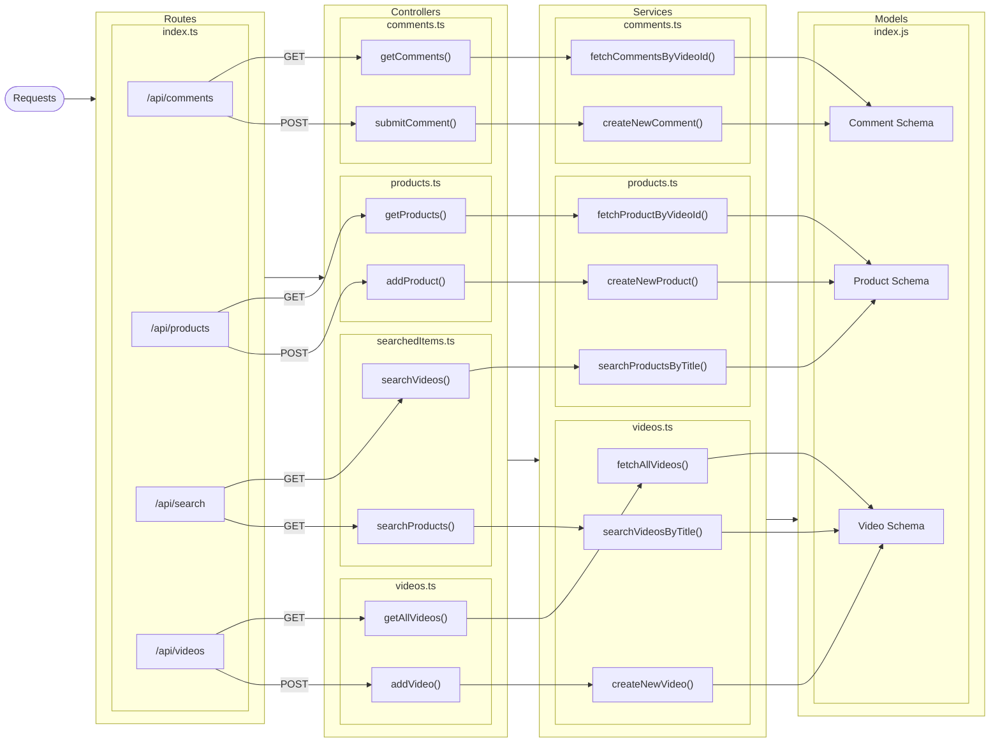

# Backend

# Getting Started

Clone the repo:
`git clone https://github.com/ikbakk/GG-3.0-Final-Project.git`

cd to backend folder:

```bash
cd backend
```

run:

```bash
npm install
```

Then run the dev server

```bash
npm run dev
```

or with pnpm:

```bash
pnpm install
```

Then run the dev server:

```bash
pnpm dev
```

Then the server will run on port 3000 as default

## Environment Variables

example for `.env` file

```
NODE_ENV=production
PORT=80
DATABASE_URL=mongodb url
```

# Database structure

### Comments Collection

```
[
  {
    "id": <Mongodb ObjectId>,
    "videoID": <Mongodb ObjectId>
    "comment": string
    "username": string
    "timestamp": datetime(iso 8601)
  }
]
```

### Products Collection

```
[
  {
    "id": <Mongodb ObjectId>,
    "videoID": <Mongodb ObjectId>
    "title": string
    "urlProduct": string
    "price": number
  }
]
```

### Videos Collection

```
[
  {
    "id": <Mongodb ObjectId>,
    "title": string,
    "url": string,
  }
]
```

# API Structure



##

# API Responses and Requests

## Comments

- Comment object
  ```
  {
    id: string,
    videoID: string,
    comment: string,
    username: string,
    timestamp: datetime(iso 8601)
  }
  ```

#### Get /api/comments

Returns all comments for particular video

- **URL Params**
  - **/:videoID**
    `videoID: string`
- **Data Params**
  None

- **Headers**
  Content-Type: application/json
- **Success Response:**
  - **Code:** 200
  - **Content:**
    ```
    [
      {
        "status": "Success",
        "data": [{<comment object>}]
      }
    ]
    ```
- **Error Response:**
  - **Code:** 400
  - **Content:**
    ```
    {
      "status": "Failed",
      "message": "Video ID is required"
    }
    ```
    or
  - **Code:** 404
  - **Content:**
    ```
    {
      "status": "Failed",
      "message": "Video not found"
    }
    ```

#### Post /api/comments

Adds a new comment to a video

- **URL Params**
  - **/:videoID**
    `videoID: string`
- **Data Params**

  - **Body:**
    ```
    {
      comment: string,
      username: string
    }
    ```

- **Headers**
  Content-Type: application/json
- **Success Response:**
  - **Code:** 200
  - **Content:**
    ```
    {
      status: "success",
      data: {<comment object>}
    }
    ```
- **Error Response:**

  - **Code:** 400
  - **Content:**

    ```
    {
      status: "Failed" ,
      message: "Missing required attributes"
    }
    ```

    or

  - **Code:** 404
  - **Content:**
    ```
    {
      status: "Failed",
      message: "Video not found"
    }
    ```

## Products

- Product object
  ```
  {
    id: string,
    videoID: string,
    title: string,
    urlProduct: string,
    price: number
  }
  ```

#### Get /api/products

Returns all products for particular video

- **URL Params**
  - **/:videoID**
    `videoID: string`
- **Data Params**
  None

- **Headers**
  Content-Type: application/json
- **Success Response:**
  - **Code:** 200
  - **Content:**
    ```
    [
      {
        "status": "Success",
        "data": [{<product object>}]
      }
    ]
    ```
- **Error Response:**
  - **Code:** 400
  - **Content:**
    ```
    {
      "status": "Failed",
      "message": "Video ID is required"
    }
    ```
    or
  - **Code:** 404
  - **Content:**
    ```
    {
      "status": "Failed",
      "message": "Video not found"
    }
    ```

#### Post /api/products

Adds a new product to a video

- **URL Params**
  - **/:videoID**
    `videoID: string`
- **Data Params**

  - **Body:**
    ```
    {
      title: string,
      urlProduct: string,
      price: number
    }
    ```

- **Headers**
  Content-Type: application/json
- **Success Response:**
  - **Code:** 201
  - **Content:**
    ```
    {
      "status": "Success",
    }
    ```
- **Error Response:**
  - **Code:** 400
  - **Content:**
    ```
    {
      "status": "Failed",
      "message": "Video ID is required"
    }
    ```
    or
  - **Code:** 404
  - **Content:**
    ```
    {
      "status": "Failed",
      "message": "Video not found"
    }
    ```

#### Get /api/search/products

Returns products that contain query parameter in their title

- **URL Params**
  - **Query Params:**
    ```
    {
      title: string
    }
    ```
- **Data Params**
  None
- **Headers**
  Content-Type: application/json
- **Success Response:**
  - **Code:** 200
  - **Content:**
    ```
      {
        "status": "Success",
        "data": [{<product object>}]
      }
    ```
- **Error Response:**
  - **Code:** 400
  - **Content:**
    ```
    {
      "status": "Failed",
      "message": "Title is required"
    }
    ```

## Videos

- Video object

  ```
  {
    id: string,
    title: string,
    url: string
  }
  ```

#### Get /api/videos

Returns all videos

- **URL Params**
  None
- **Data Params**
  None
- **Headers**
  Content-Type: application/json
- **Success Response:**
  - **Code:** 200
  - **Content:**
    ```
    {
      "status": "Success",
      "data": [{<video object>}]
    }
    ```

#### Post /api/videos

Adds a new video to a video

- **URL Params**
  None
- **Data Params**

  - **Body:**
    ```
    {
      title: string,
      url: string
    }
    ```

- **Headers**
  Content-Type: application/json
- **Success Response:**
  - **Code:** 201
  - **Content:**
    ```
    {
      "status": "Success",
    }
    ```
- **Error Response:**
  - **Code:** 400
  - **Content:**
    ```
    {
      "status": "Failed",
      "message": "Missing required attributes"
    }
    ```

#### Get /api/search/videos

Returns videos that contain query parameter in their title

- **URL Params**
  - **Query Params:**
    ```
    {
      title: string
    }
    ```
- **Data Params**
  None
- **Headers**
  Content-Type: application/json
- **Success Response:**
  - **Code:** 200
  - **Content:**
    ```
    {
      "status": "Success",
      "data": [{<video object>}]
    }
    ```
- **Error Response:**
  - **Code:** 400
  - **Content:**
    ```
    {
      "status": "Failed",
      "message": "Title is required"
    }
    ```
